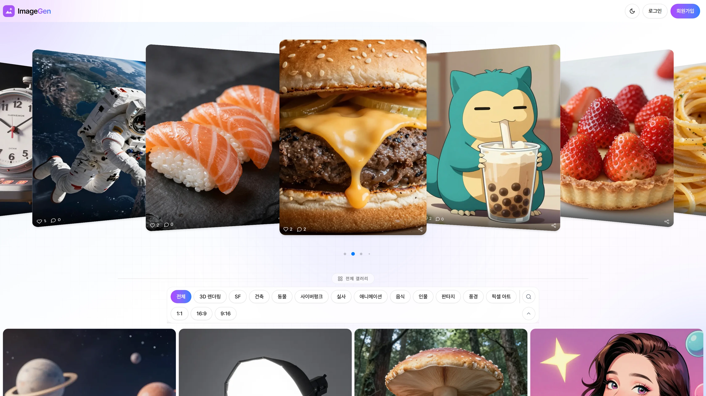
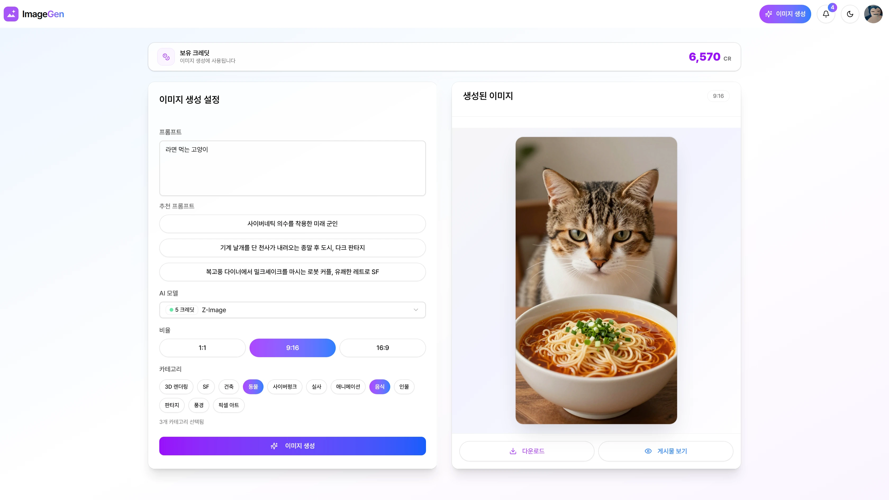
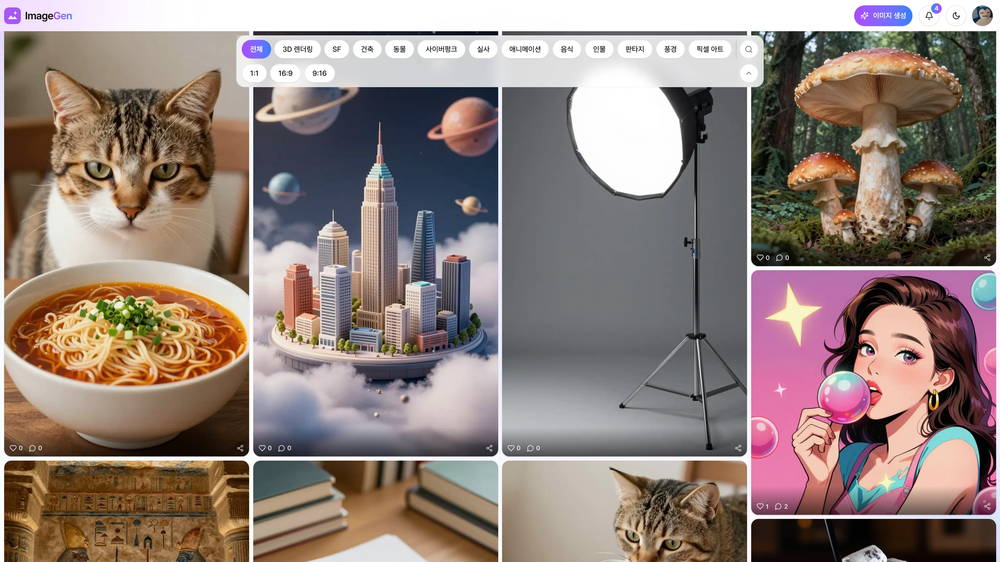
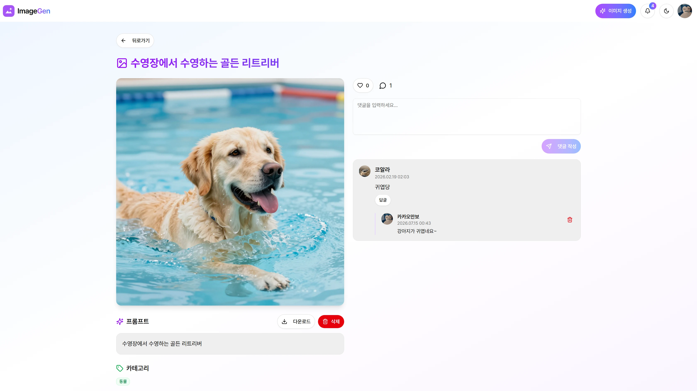
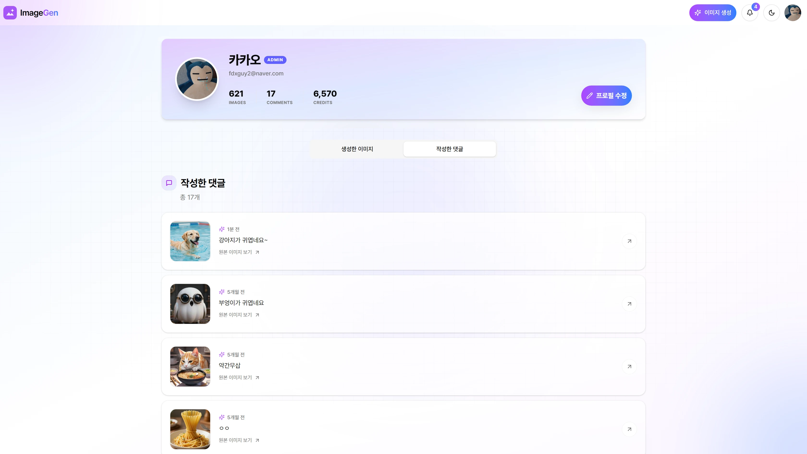
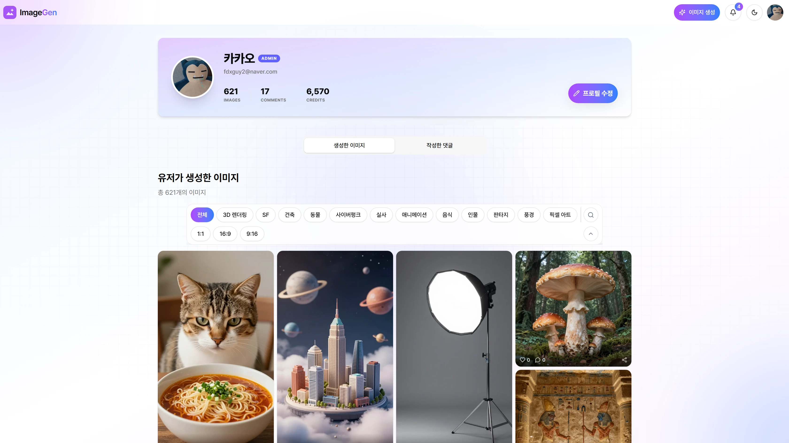
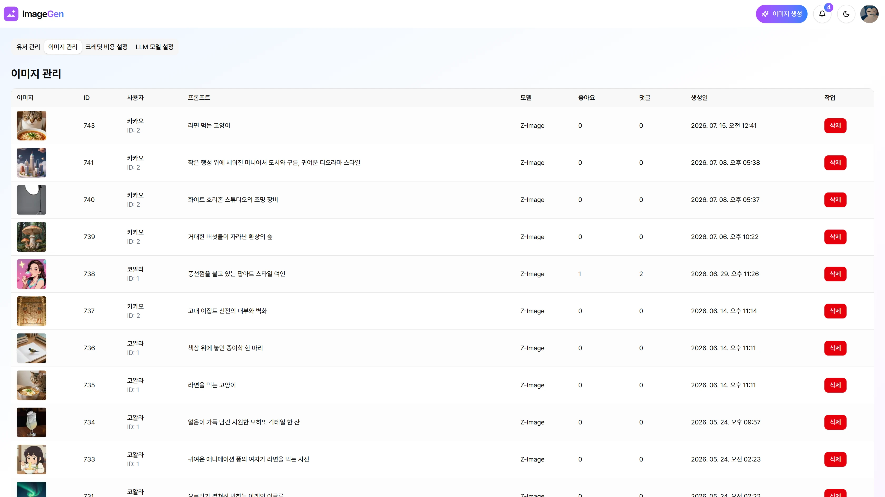
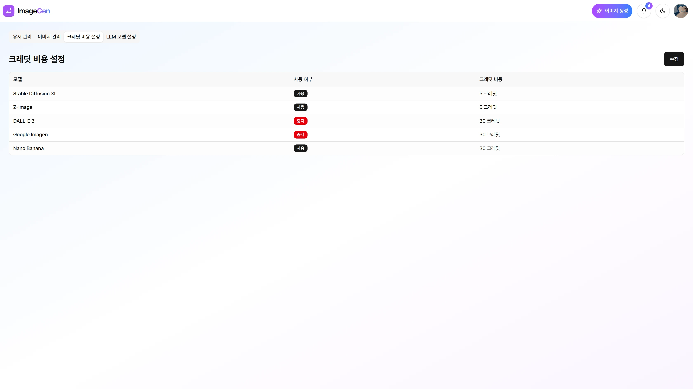

# ImageGen - AI 이미지 생성 서비스

Next.js와 여러 이미지 모델을 사용한 AI 이미지 생성 웹 애플리케이션입니다.

## 주요 기능

- API와 로컬 모델을 사용하여 AI 이미지 생성 (api - DALL-E 3, Google Imagen, Nano Banana | local - Stable Diffusion XL, Z Image Turbo)
- 이미지 생성 시 공유
- 좋아요 및 댓글 추가
- 프로필 조회 및 수정
- 관리자 대시보드 (유저/이미지 관리, 크레딧 비용 및 LLM 모델 설정)

## 🏗️ 인프라 아키텍처 및 특징

클라우드 비용 절감과 고성능 AI 모델 서빙을 위해 **Home Lab(On-Premise)** 환경을 구축했습니다.

### Why Self-Hosted?
- **비용 효율성:** 고사양 GPU가 필요한 AI 이미지 생성 모델을 AWS g5 인스턴스 등으로 구동 시 발생하는 막대한 비용을 로컬 데스크톱(RTX 5090기반)을 활용해 절감했습니다.
- **데이터 주권:** 생성된 이미지와 프롬프트 데이터를 로컬 DB(MySQL)에 직접 저장하여 관리합니다.

### Network & Security
- **WSL2 Mirroring Mode:** 윈도우 호스트와 WSL 간의 네트워크 장벽을 없애기 위해 미러링 모드를 적용, 복잡한 포트포워딩 설정 없이 `localhost` 통신 환경을 최적화했습니다.
- **Reverse Proxy (Nginx):** - SSL 인증서 적용 (HTTPS)
  - 내부 포트(3000, 3306 등) 외부 노출 차단
- **Port Forwarding:** 공유기 단에서 80/443 포트만 개방하여 보안 위협을 최소화했습니다.

### CI/CD Pipeline
- **GitHub Actions Self-hosted Runner:** - 외부에서 로컬 서버로의 직접 접속(SSH) 없이, Runner가 GitHub의 Job을 가져오는(Polling) 방식으로 보안을 강화했습니다.
  - `Push` -> `Build` -> `PM2 Reload` 과정을 완전 자동화하여 무중단 배포 환경을 구현했습니다.

## 기술 스택

- **Frontend**: Next.js 16, React 19.2, TypeScript
- **Styling**: Tailwind CSS, shadcn/ui
- **Database**: MySQL (Prisma ORM)
- **AI Service**: OpenAI API, Google Imagen API, Stable Diffusion, Ollama
- **Authentication**: JWT, bcryptjs
- **State Management**: TanStack Query, Zustand

## 라이선스

MIT License
