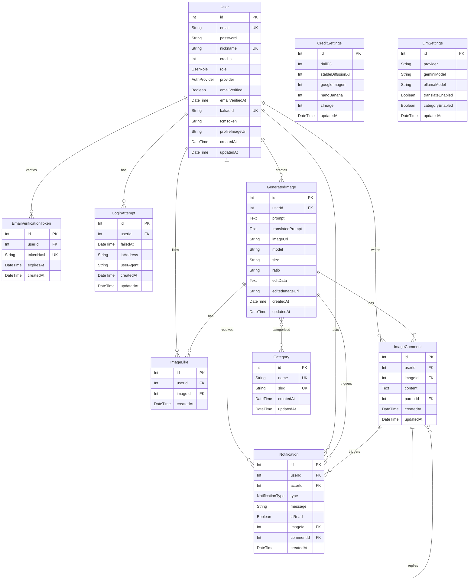

# ERD

`prisma/schema.prisma` 기준의 데이터베이스 구조입니다. Prisma 모델명이 별도로 매핑되지 않은 경우 실제 테이블명은 모델명과 같습니다.

## Table Summary

| Table | Purpose | Primary Key | Main Foreign Keys | Unique Constraints | Indexes |
| --- | --- | --- | --- | --- | --- |
| `User` | 사용자, 인증 제공자, 크레딧, 프로필 정보 | `id` | - | `email`, `nickname`, `kakaoId` | - |
| `EmailVerificationToken` | 이메일 인증 토큰 | `id` | `userId -> User.id` | `tokenHash` | `userId`, `expiresAt` |
| `LoginAttempt` | 로그인 실패 이력 | `id` | `userId -> User.id` | - | `userId` |
| `GeneratedImage` | 생성된 이미지와 프롬프트/모델 정보 | `id` | `userId -> User.id` | - | `userId`, `createdAt`, `model` |
| `ImageLike` | 이미지 좋아요 | `id` | `userId -> User.id`, `imageId -> GeneratedImage.id` | `userId + imageId` | `userId`, `imageId` |
| `ImageComment` | 이미지 댓글과 대댓글 | `id` | `userId -> User.id`, `imageId -> GeneratedImage.id`, `parentId -> ImageComment.id` | - | `userId`, `imageId`, `parentId` |
| `credit_settings` | 모델별 크레딧 비용 설정 | `id` | - | - | - |
| `llm_settings` | LLM 번역/카테고리 설정 | `id` | - | - | - |
| `Category` | 이미지 카테고리 | `id` | - | `name`, `slug` | - |
| `Notification` | 좋아요/댓글 알림 | `id` | `userId -> User.id`, `actorId -> User.id`, `imageId -> GeneratedImage.id`, `commentId -> ImageComment.id` | - | `userId`, `isRead` |
| `_CategoryToGeneratedImage` | `Category`와 `GeneratedImage`의 Prisma 암시적 N:M 조인 테이블 | `A + B` | `A -> Category.id`, `B -> GeneratedImage.id` | `A + B` | `B` |

## Columns

### User

| Column | Type | Required | Default | Notes |
| --- | --- | --- | --- | --- |
| `id` | `Int` | Yes | `autoincrement()` | PK |
| `email` | `String` | Yes | - | Unique |
| `password` | `String` | No | - | 로컬 로그인 비밀번호 |
| `nickname` | `String` | Yes | - | Unique |
| `credits` | `Int` | Yes | `100` | 사용자 보유 크레딧 |
| `role` | `UserRole` | Yes | `user` | `user`, `admin` |
| `provider` | `AuthProvider` | Yes | `local` | `local`, `kakao` |
| `emailVerified` | `Boolean` | Yes | `true` | 이메일 인증 여부 |
| `emailVerifiedAt` | `DateTime` | No | - | 이메일 인증 시각 |
| `kakaoId` | `String` | No | - | Unique, Kakao 고유 ID |
| `fcmToken` | `String` | No | - | FCM 토큰 |
| `profileImageUrl` | `String` | No | - | 프로필 이미지 URL |
| `createdAt` | `DateTime` | Yes | `now()` | 생성 시각 |
| `updatedAt` | `DateTime` | Yes | `@updatedAt` | 수정 시각 |

### EmailVerificationToken

| Column | Type | Required | Default | Notes |
| --- | --- | --- | --- | --- |
| `id` | `Int` | Yes | `autoincrement()` | PK |
| `userId` | `Int` | Yes | - | FK to `User.id`, cascade delete |
| `tokenHash` | `String` | Yes | - | Unique |
| `expiresAt` | `DateTime` | Yes | - | 만료 시각 |
| `createdAt` | `DateTime` | Yes | `now()` | 생성 시각 |

### LoginAttempt

| Column | Type | Required | Default | Notes |
| --- | --- | --- | --- | --- |
| `id` | `Int` | Yes | `autoincrement()` | PK |
| `userId` | `Int` | Yes | - | FK to `User.id` |
| `failedAt` | `DateTime` | Yes | `now()` | 실패 시각 |
| `ipAddress` | `String` | No | - | 요청 IP |
| `userAgent` | `String` | No | - | 브라우저/클라이언트 정보 |
| `createdAt` | `DateTime` | Yes | `now()` | 생성 시각 |
| `updatedAt` | `DateTime` | Yes | `@updatedAt` | 수정 시각 |

### GeneratedImage

| Column | Type | Required | Default | Notes |
| --- | --- | --- | --- | --- |
| `id` | `Int` | Yes | `autoincrement()` | PK |
| `userId` | `Int` | Yes | - | FK to `User.id` |
| `prompt` | `String @db.Text` | Yes | - | 원본 프롬프트 |
| `translatedPrompt` | `String @db.Text` | No | - | 번역 프롬프트 |
| `imageUrl` | `String` | Yes | - | 생성 이미지 URL |
| `model` | `String` | Yes | - | 사용 모델 |
| `size` | `String` | Yes | `"1024x1024"` | 이미지 크기 |
| `ratio` | `String` | Yes | `"1:1"` | 이미지 비율 |
| `editData` | `String @db.Text` | No | - | 편집 데이터 |
| `editedImageUrl` | `String` | No | - | 편집 이미지 URL |
| `createdAt` | `DateTime` | Yes | `now()` | 생성 시각 |
| `updatedAt` | `DateTime` | Yes | `@updatedAt` | 수정 시각 |

### ImageLike

| Column | Type | Required | Default | Notes |
| --- | --- | --- | --- | --- |
| `id` | `Int` | Yes | `autoincrement()` | PK |
| `userId` | `Int` | Yes | - | FK to `User.id`, cascade delete |
| `imageId` | `Int` | Yes | - | FK to `GeneratedImage.id`, cascade delete |
| `createdAt` | `DateTime` | Yes | `now()` | 생성 시각 |

### ImageComment

| Column | Type | Required | Default | Notes |
| --- | --- | --- | --- | --- |
| `id` | `Int` | Yes | `autoincrement()` | PK |
| `userId` | `Int` | Yes | - | FK to `User.id`, cascade delete |
| `imageId` | `Int` | Yes | - | FK to `GeneratedImage.id`, cascade delete |
| `content` | `String @db.Text` | Yes | - | 댓글 내용 |
| `parentId` | `Int` | No | - | FK to `ImageComment.id`, cascade delete |
| `createdAt` | `DateTime` | Yes | `now()` | 생성 시각 |
| `updatedAt` | `DateTime` | Yes | `@updatedAt` | 수정 시각 |

### credit_settings

| Column | Type | Required | Default | Notes |
| --- | --- | --- | --- | --- |
| `id` | `Int` | Yes | `1` | PK, 단일 설정 레코드 용도 |
| `dallE3` | `Int` | Yes | `20` | DALL-E 3 크레딧 비용 |
| `stableDiffusionXl` | `Int` | Yes | `5` | Stable Diffusion XL 크레딧 비용 |
| `googleImagen` | `Int` | Yes | `20` | Google Imagen 크레딧 비용 |
| `nanoBanana` | `Int` | Yes | `20` | Nano Banana 크레딧 비용 |
| `zImage` | `Int` | Yes | `10` | Z-Image 크레딧 비용 |
| `updatedAt` | `DateTime` | Yes | `@updatedAt` | 수정 시각 |

### llm_settings

| Column | Type | Required | Default | Notes |
| --- | --- | --- | --- | --- |
| `id` | `Int` | Yes | `1` | PK, 단일 설정 레코드 용도 |
| `provider` | `String` | Yes | `"ollama"` | LLM 제공자 |
| `geminiModel` | `String` | Yes | `"gemini-2.5-flash-lite"` | Gemini 모델명 |
| `ollamaModel` | `String` | Yes | `"gemma3:4b"` | Ollama 모델명 |
| `translateEnabled` | `Boolean` | Yes | `true` | 프롬프트 번역 사용 여부 |
| `categoryEnabled` | `Boolean` | Yes | `true` | 카테고리 추천 사용 여부 |
| `updatedAt` | `DateTime` | Yes | `@updatedAt` | 수정 시각 |

### Category

| Column | Type | Required | Default | Notes |
| --- | --- | --- | --- | --- |
| `id` | `Int` | Yes | `autoincrement()` | PK |
| `name` | `String` | Yes | - | Unique |
| `slug` | `String` | Yes | - | Unique, URL-friendly 이름 |
| `createdAt` | `DateTime` | Yes | `now()` | 생성 시각 |
| `updatedAt` | `DateTime` | Yes | `@updatedAt` | 수정 시각 |

### Notification

| Column | Type | Required | Default | Notes |
| --- | --- | --- | --- | --- |
| `id` | `Int` | Yes | `autoincrement()` | PK |
| `userId` | `Int` | Yes | - | FK to `User.id`, 알림 수신자, cascade delete |
| `actorId` | `Int` | Yes | - | FK to `User.id`, 알림 발생자, cascade delete |
| `type` | `NotificationType` | Yes | - | `LIKE`, `COMMENT` |
| `message` | `String` | No | - | 알림 메시지 |
| `isRead` | `Boolean` | Yes | `false` | 읽음 여부 |
| `imageId` | `Int` | No | - | FK to `GeneratedImage.id`, cascade delete |
| `commentId` | `Int` | No | - | FK to `ImageComment.id`, cascade delete |
| `createdAt` | `DateTime` | Yes | `now()` | 생성 시각 |

## Relationships

| From | To | Cardinality | Field | Delete Rule |
| --- | --- | --- | --- | --- |
| `User` | `EmailVerificationToken` | 1:N | `EmailVerificationToken.userId` | Cascade |
| `User` | `LoginAttempt` | 1:N | `LoginAttempt.userId` | Not specified |
| `User` | `GeneratedImage` | 1:N | `GeneratedImage.userId` | Not specified |
| `User` | `ImageLike` | 1:N | `ImageLike.userId` | Cascade |
| `GeneratedImage` | `ImageLike` | 1:N | `ImageLike.imageId` | Cascade |
| `User` | `ImageComment` | 1:N | `ImageComment.userId` | Cascade |
| `GeneratedImage` | `ImageComment` | 1:N | `ImageComment.imageId` | Cascade |
| `ImageComment` | `ImageComment` | 1:N self relation | `ImageComment.parentId` | Cascade |
| `GeneratedImage` | `Category` | N:M | implicit `_CategoryToGeneratedImage` | Prisma default |
| `User` | `Notification` | 1:N recipient | `Notification.userId` | Cascade |
| `User` | `Notification` | 1:N actor | `Notification.actorId` | Cascade |
| `GeneratedImage` | `Notification` | 1:N optional | `Notification.imageId` | Cascade |
| `ImageComment` | `Notification` | 1:N optional | `Notification.commentId` | Cascade |

## Mermaid ERD

## Enums

| Enum | Values |
| --- | --- |
| `UserRole` | `user`, `admin` |
| `AuthProvider` | `local`, `kakao` |
| `NotificationType` | `LIKE`, `COMMENT` |
